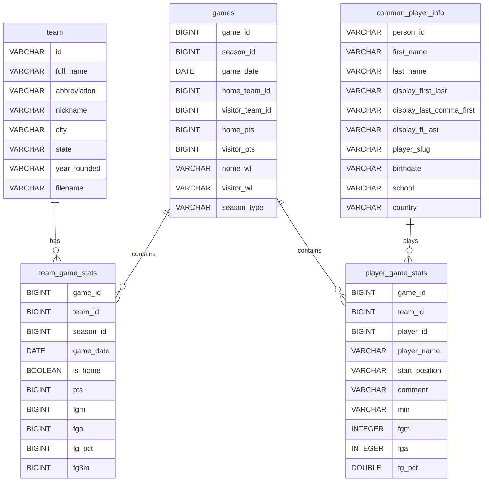

# NBA Database - Entity-Relationship Diagram

*Generated: 2026-01-05 17:03:21*

## Core Tables ERD

## Notes

- This diagram shows core tables and their primary relationships
- Full database contains 75+ tables across raw, silver, and gold layers
- See [Semantic Analysis](03_semantic_analysis.md) for complete relationship details
